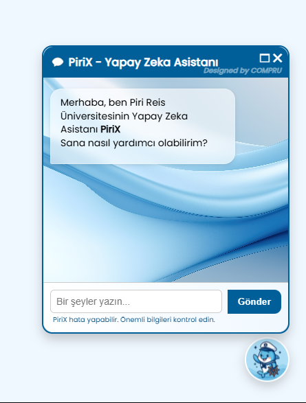

# 🎓 PiriX



PiriX – Piri Reis Üniversitesi için Yapay Zeka Destekli Chatbot & Bilgi Sistemi  
*Django ile geliştirildi | Python, HTML, CSS, JavaScript*

---

> **AI-powered university assistant**  
> Bilgiye hızlı ulaşım, akıllı yanıtlar ve modern web arayüzüyle öğrenciler ile akademisyenler için yeni nesil bilgi sistemi.

---


---

## 📌 Proje Özeti

**django_version**, Piri Reis Üniversitesi'nin akademik ve öğrenci işleri ile ilgili soruları yanıtlayan, OpenAI tabanlı bir sohbet botu ve web platformudur.  
Kullanıcılar; bölümler, ücretler, burslar, ders içerikleri ve kampüs yaşamı gibi konularda doğal dilde soru sorabilir ve güncel bilgi alabilir.

---

## 🚀 Başlıca Özellikler

- **Django Tabanlı Backend:** Güçlü ve esnek Python altyapısı
- **OpenAI API Entegrasyonu:** Akıllı ve bağlam koruyan yanıtlar
- **Sohbet Geçmişi Özeti:** Konu bütünlüğü için otomatik özetleme
- **Modern Web Arayüzü:** Kullanıcı dostu ve responsive tasarım (HTML, CSS, JavaScript)
- **Bölüm, Ücret, Burs, Erasmus, Akademik Takvim gibi konularda sorgulama**
- **Çoklu dil desteği ve gelişmiş arama fonksiyonları**
- **Kolay özelleştirilebilir yapı**

---

## 🗂️ Dosya ve Klasör Yapısı

```
django_version/
├── .gitignore
├── .idea/
├── README.md
├── chatbot/
│   ├── __init__.py
│   ├── models.py
│   ├── views.py
│   ├── templates/
│   └── static/
├── deneme.py
├── requirements.txt
├── manage.py
├── templates/
│   └── *.html
├── static/
│   ├── css/
│   ├── js/
│   └── img/
├── .env          # Ortam değişkenleri, gizli tutulur!
```

- `.gitignore`         : Versiyon kontrolüne dahil edilmeyecek dosyalar
- `.idea/`             : IDE (PyCharm vb.) proje ayarları
- `README.md`          : Proje açıklama ve kullanım dokümantasyonu
- `chatbot/`           : Chatbot ve ilgili Django uygulama dosyaları
- `deneme.py`          : Test/örnek Python dosyası
- `requirements.txt`   : Gerekli Python paketleri
- `manage.py`          : Django yönetim komutları
- `templates/`         : HTML şablonları
- `static/`            : CSS, JS, ve görseller
- `.env`               : Ortam değişkenleri (gizli, versiyon kontrolüne eklenmez)

---

## 🛠️ Kurulum ve Çalıştırma

1. **Repoyu Klonlayın:**
   ```bash
   git clone https://github.com/tnerler/django_version.git
   cd django_version
   ```
2. **Gerekli Paketleri Yükleyin:**
   ```bash
   pip install -r requirements.txt
   ```
3. **Ortam Değişkenlerini Tanımlayın:**
   - `.env` dosyasına OpenAI API anahtarınızı ve diğer özel bilgileri ekleyin.
4. **Veritabanı Migrasyonlarını Uygulayın:**
   ```bash
   python manage.py migrate
   ```
5. **Sunucuyu Başlatın:**
   ```bash
   python manage.py runserver
   ```
6. **Web arayüzüne gidin ve sorularınızı sorun!**

---

## 👩‍💻 Kullanım Senaryoları

- **Bölüm Bilgisi Sorma:**  
  “Bilgisayar Mühendisliği dersleri neler?”
- **Ücret ve Burs Bilgisi:**  
  “2025-2026 Hukuk Fakültesi ücretleri nedir?”
- **Kampüs Olanakları:**  
  “Erasmus ile yurtdışına nasıl gidebilirim?”
- **Akademik Takvim:**  
  “Final sınavları ne zaman başlıyor?”

---

## 💡 Katkı ve Geliştirme

- Fork'layın, branch açın, PR gönderin!
- Hatalar, öneriler ve yeni özellikler için [issue açabilirsiniz](https://github.com/tnerler/django_version/issues).
- Kod kalitesini korumak için PEP8 ve Django en iyi uygulamalarına dikkat edin.

---

## 📚 Teknolojiler

- **Python (%91.9)**
- **CSS (%4.2)**
- **JavaScript (%3.1)**
- **HTML (%0.8)**
- **OpenAI GPT entegrasyonu**
- **Django framework**

---

## 📝 Lisans

MIT Lisansı – Dilediğiniz gibi kullanabilir, geliştirebilirsiniz.

---

## 📣 İletişim

Sorularınız, geri bildirimleriniz ve geliştirme talepleriniz için:  
[GitHub Profilim](https://github.com/tnerler)

---

> 🚢 PiriX ile üniversite hayatı daha kolay!
